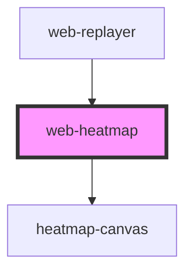

# web-heatmap

<!-- Auto Generated Below -->

## Properties

| Property              | Attribute      | Description | Type                                     | Default     |
| --------------------- | -------------- | ----------- | ---------------------------------------- | ----------- |
| `colorScheme`         | `color-scheme` |             | `"cool" \| "custom" \| "warm"`           | `'warm'`    |
| `events` _(required)_ | --             |             | `RrwebEvent[]`                           | `undefined` |
| `opacity`             | `opacity`      |             | `number`                                 | `0.6`       |
| `type`                | `type`         |             | `"all" \| "click" \| "move" \| "scroll"` | `'all'`     |

## Dependencies

### Used by

 - [web-replayer](../replayer)

### Depends on

- [heatmap-canvas](.)

### Graph

----------------------------------------------

*Built with [StencilJS](https://stenciljs.com/)*
