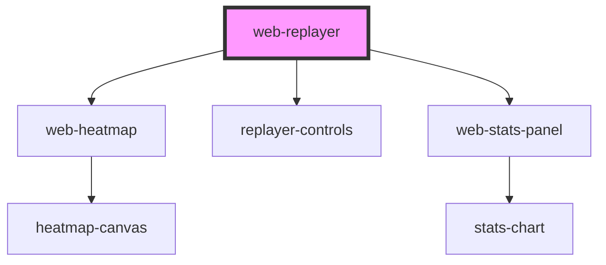

# web-replayer

<!-- Auto Generated Below -->

## Properties

| Property            | Attribute       | Description | Type                  | Default     |
| ------------------- | --------------- | ----------- | --------------------- | ----------- |
| `autoPlay`          | `auto-play`     |             | `boolean`             | `false`     |
| `data` _(required)_ | `data`          |             | `string`              | `undefined` |
| `height`            | `height`        |             | `number \| undefined` | `undefined` |
| `showControls`      | `show-controls` |             | `boolean`             | `true`      |
| `showHeatmap`       | `show-heatmap`  |             | `boolean`             | `false`     |
| `showStats`         | `show-stats`    |             | `boolean`             | `false`     |
| `speed`             | `speed`         |             | `number`              | `1`         |
| `startTime`         | `start-time`    |             | `number`              | `0`         |
| `width`             | `width`         |             | `number \| undefined` | `undefined` |

## Events

| Event              | Description | Type                                  |
| ------------------ | ----------- | ------------------------------------- |
| `decompressError`  |             | `CustomEvent<DecompressErrorDetail>`  |
| `heatmapReady`     |             | `CustomEvent<HeatmapReadyDetail>`     |
| `replayFinish`     |             | `CustomEvent<void>`                   |
| `replayPause`      |             | `CustomEvent<void>`                   |
| `replayReady`      |             | `CustomEvent<ReplayReadyDetail>`      |
| `replayStart`      |             | `CustomEvent<void>`                   |
| `replayTimeUpdate` |             | `CustomEvent<ReplayTimeUpdateDetail>` |
| `statsReady`       |             | `CustomEvent<StatsReadyDetail>`       |

## Methods

### `getAnalytics() => Promise<AnalyticsData | null>`

#### Returns

Type: `Promise<AnalyticsData | null>`

### `getEvents() => Promise<RrwebEvent[]>`

#### Returns

Type: `Promise<RrwebEvent[]>`

### `pause() => Promise<void>`

#### Returns

Type: `Promise<void>`

### `play() => Promise<void>`

#### Returns

Type: `Promise<void>`

### `seek(time: number) => Promise<void>`

#### Parameters

| Name   | Type     | Description |
| ------ | -------- | ----------- |
| `time` | `number` |             |

#### Returns

Type: `Promise<void>`

## Dependencies

### Depends on

- [web-heatmap](../heatmap)
- [replayer-controls](.)
- [web-stats-panel](../stats-panel)

### Graph

----------------------------------------------

*Built with [StencilJS](https://stenciljs.com/)*
