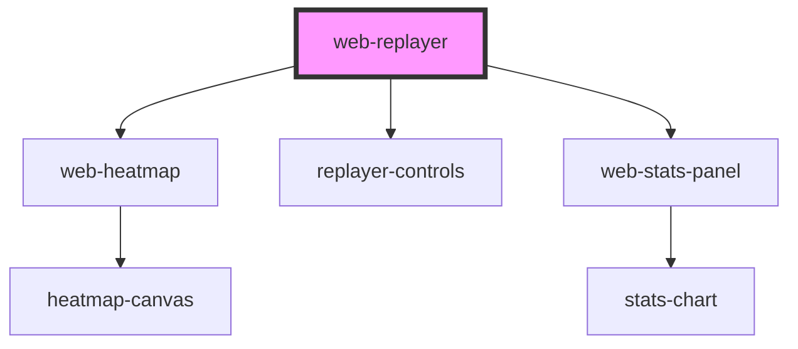

# web-replayer

<!-- Auto Generated Below -->

## Properties

| Property             | Attribute              | Description                                                                                                                                                                                                                                                                                                                                                                                                            | Type                  | Default     |
| -------------------- | ---------------------- | ---------------------------------------------------------------------------------------------------------------------------------------------------------------------------------------------------------------------------------------------------------------------------------------------------------------------------------------------------------------------------------------------------------------------- | --------------------- | ----------- |
| `autoHideControls`   | `auto-hide-controls`   | Auto-hide controls when mouse idle for a while. Default false.                                                                                                                                                                                                                                                                                                                                                         | `boolean`             | `false`     |
| `autoPlay`           | `auto-play`            |                                                                                                                                                                                                                                                                                                                                                                                                                        | `boolean`             | `false`     |
| `data` _(required)_  | `data`                 | Session data — accepts multiple formats: - Compressed string (LZ-String URI-safe/UTF-16/Base64, pako gzip base64) - JSON-serialized string (JSON.stringify of an event array) - Raw event array (RrwebEvent[] or any[] with timestamp+type fields) Auto-detection picks the optimal path: arrays skip decompress+parse, JSON strings skip decompress, compressed strings go through full pipeline.                     | `any[] \| string`     | `undefined` |
| `fullscreenMaxRatio` | `fullscreen-max-ratio` | Maximum scale ratio in fullscreen mode (default 1.15). Prevents small recorded pages from being blown up too large. When the contain-mode scale exceeds this ratio, the replay is capped at original size × fullscreenMaxRatio and centered in the container. Only applies in fullscreen — non-fullscreen scaling is unchanged.                                                                                        | `number`              | `1.15`      |
| `height`             | `height`               | Component height — accepts CSS values: "888px", "60vh", or bare number "888" (treated as px).                                                                                                                                                                                                                                                                                                                          | `string \| undefined` | `undefined` |
| `interact`           | `interact`             | Enable user interaction with the replayed UI (clicks, inputs, scrolling). Default false — replay is non-interactive for stability. When true, calls replayer.enableInteract() which sets pointer-events: auto on the replay iframe. Note: enabling interaction may cause instability (e.g., navigating away via external links). Use with caution.                                                                     | `boolean`             | `false`     |
| `showControls`       | `show-controls`        |                                                                                                                                                                                                                                                                                                                                                                                                                        | `boolean`             | `true`      |
| `showHeatmap`        | `show-heatmap`         | Show heatmap overlay. Default false.                                                                                                                                                                                                                                                                                                                                                                                   | `boolean`             | `false`     |
| `showStats`          | `show-stats`           | Show stats panel. Default false.                                                                                                                                                                                                                                                                                                                                                                                       | `boolean`             | `false`     |
| `speed`              | `speed`                |                                                                                                                                                                                                                                                                                                                                                                                                                        | `number`              | `1`         |
| `startTime`          | `start-time`           |                                                                                                                                                                                                                                                                                                                                                                                                                        | `number`              | `0`         |
| `unsafeAllowScripts` | `unsafe-allow-scripts` | Allow scripts execution in the replay iframe. Default false for security. When true, rrweb creates iframe with sandbox="allow-same-origin allow-scripts". When false, rrweb uses sandboxed iframe with only "allow-same-origin" (scripts blocked). The "Blocked script execution" console warning when unsafeAllowScripts=false is expected — rrweb rebuilds the DOM via mutations, not by executing recorded scripts. | `boolean`             | `true`      |
| `width`              | `width`                | Component width — accepts CSS values: "85%", "800px", "50vw", or bare number "800" (treated as px).                                                                                                                                                                                                                                                                                                                    | `string \| undefined` | `undefined` |

## Events

| Event                    | Description | Type                                        |
| ------------------------ | ----------- | ------------------------------------------- |
| `decompressError`        |             | `CustomEvent<DecompressErrorDetail>`        |
| `heatmapReady`           |             | `CustomEvent<HeatmapReadyDetail>`           |
| `replayFinish`           |             | `CustomEvent<void>`                         |
| `replayFullscreenChange` |             | `CustomEvent<ReplayFullscreenChangeDetail>` |
| `replayPause`            |             | `CustomEvent<void>`                         |
| `replayReady`            |             | `CustomEvent<ReplayReadyDetail>`            |
| `replayStart`            |             | `CustomEvent<void>`                         |
| `replayTimeUpdate`       |             | `CustomEvent<ReplayTimeUpdateDetail>`       |
| `statsReady`             |             | `CustomEvent<StatsReadyDetail>`             |

## Methods

### `getAnalytics() => Promise<AnalyticsData | null>`

#### Returns

Type: `Promise<AnalyticsData | null>`

### `getEvents() => Promise<RrwebEvent[]>`

#### Returns

Type: `Promise<RrwebEvent[]>`

### `pause() => Promise<void>`

#### Returns

Type: `Promise<void>`

### `play() => Promise<void>`

#### Returns

Type: `Promise<void>`

### `seek(time: number) => Promise<void>`

#### Parameters

| Name   | Type     | Description |
| ------ | -------- | ----------- |
| `time` | `number` |             |

#### Returns

Type: `Promise<void>`

## Dependencies

### Depends on

- [web-heatmap](../heatmap)
- [replayer-controls](.)
- [web-stats-panel](../stats-panel)

### Graph

----------------------------------------------

*Built with [StencilJS](https://stenciljs.com/)*
