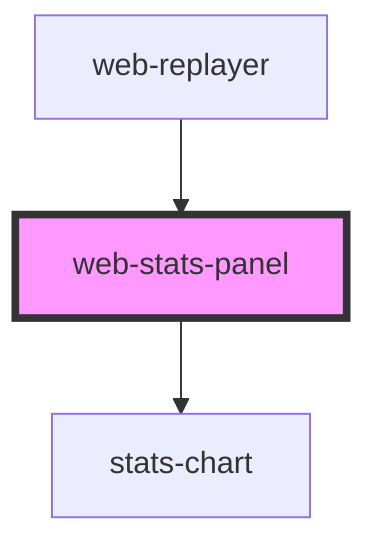

# web-stats-panel

<!-- Auto Generated Below -->

## Properties

| Property              | Attribute | Description | Type                               | Default                                               |
| --------------------- | --------- | ----------- | ---------------------------------- | ----------------------------------------------------- |
| `events` _(required)_ | --        |             | `RrwebEvent[]`                     | `undefined`                                           |
| `layout`              | `layout`  |             | `"bottom" \| "modal" \| "sidebar"` | `'sidebar'`                                           |
| `metrics`             | --        |             | `StatsMetric[]`                    | `['clicks', 'scrolls', 'inputs', 'duration', 'path']` |

## Dependencies

### Used by

 - [web-replayer](../replayer)

### Depends on

- [stats-chart](.)

### Graph

----------------------------------------------

*Built with [StencilJS](https://stenciljs.com/)*
